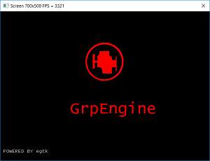

# GrpEngine
   
   
   
This is a graphic engine usefull to test graphic libraries.
Refer to *egtk* library *GrpEngine\GrpEngine\egtk* that is the base of the engine.
You can find documentatione here: *GrpEngine\GrpEngine\egtk\Doc*.

## Usage

Edit your test file source *testprj.cpp* and header *testprj.h*; only requirement is class with some public functions. Steps are:

- Program:

		class MyTestClass
		{
		public:
			TestLibraryClass(void);
		
		public:
			void OnUserCreate(void);
			void OnUserMouse(int, int, MOUSE_TYPE);
			void OnUserKeyboard(int, bool);
			bool OnUserUpdate(float) ;
		};
- Include *testprj.h* in *VSbridge.cpp*.

- Replace *MyTestClass MY_TEST* at he beginning of *VSbridge.cpp* file.

Main program will call:

1. *MyTestClass.OnUserCreate()* at the biginning of the program; first operation required is initialization of the graphic ambient: *egtkInitScreen(MY_WIDTH, MY_HEIGHT, MY_FREGRND, MY_BCKGRND);*

2. *MyTestClass.OnUserUpdate(DeltaTime)* in main loop; *DeltaTime* is the interval between two calls.

3. *MyTestClass.OnUserKeyboard(int code, bool pressed)* when press or release *pressed* a key of code *code*

4. *MyTestClass.OnUserMouse(int xPos, int yPos, MOUSE_TYPE code)* when mouse move/click/release, referto *MOUSE_TYPE* struct.

## Examples
You can find some examples *GrpEngine\GrpEngine\Examples*.

### spline
### balls
Many thanks to **javidx9**!!!!!!!!!!!

[www.onelonecoder.com](www.onelonecoder.com)

### testlibrary
Just to test egtk library.

##release

#### 25/04/2022

First

#### 26/04/2022
Timer supports added.     
Better mouse supports.     
C++ call class system.     

